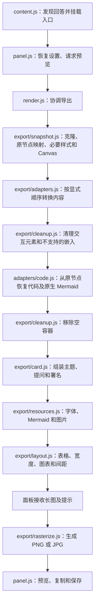

# 导出架构

本项目把 ChatGPT 单条回答的当前内容和交互状态转换为静态长图。组件兼容逻辑与面板、资源加载、排版和图片输出分别维护。

## 处理流程



## 模块边界

| 模块 | 职责 | 约束 |
| --- | --- | --- |
| `chatgpt/selectors.js`、`dom.js` | 回答、提问、生成状态及操作栏识别 | 宿主回答选择器集中维护；组件内部选择器归相应适配器 |
| `render.js` | 编排导出阶段 | 不添加组件选择器或具体控件转换逻辑 |
| `export/snapshot.js` | 建立 DOM 副本及来源映射；捕获可读取的 Canvas 和数学／SVG 样式 | 不修改原回答；过滤判断基于原 DOM |
| `export/adapters.js` | 固定适配顺序 | 适配器在清理按钮前读取原节点的实时属性 |
| `export/adapters/` | 把内容转换为静态 DOM | 不操作面板、不保存设置、不下载资源 |
| `export/cleanup.js` | 移除不应导出的节点、替换嵌入及清理空容器 | 必须保留适配器产生的静态内容 |
| `export/card.js` | 组装长图外观 | 接收转换后的内容，不识别宿主组件 |
| `export/resources.js` | 等待字体、渲染 Mermaid、解码及内联可导出图片 | 保留原有超时与失败提示 |
| `export/layout.js` | 编排已有布局策略 | 测量已挂载且资源已准备的长图 |
| `export/rasterize.js` | 栅格化、倍率限制、圆角与输出格式 | 不修改源回答或导出偏好 |
| `shared/` | 公共颜色判断、选择标记及超时 | 不依赖面板或组件适配器 |
| `styles/` | 长图样式 | 通过 `card.js` 按固定顺序合并；无运行时 CSS 网络请求 |

`src/layout.js` 保存设置校验、宽度限制和测量策略；`src/export/layout.js` 负责在导出阶段调用这些策略。

## 接口与状态

面板继续只调用以下接口：

```js
createCard(answer, options, mount) // Promise<{ card, warnings }>
rasterize(card, options)          // Promise<{ blob, layoutWidth, width, height, reduced }>
```

快照产生的上下文包括：

- `clone`：可修改的 DOM 副本。
- `sourceByCopy`：原副本节点到源节点的映射。
- `omitted`：依据源 DOM 判定排除的节点集合。
- `options`：本次渲染的设置。
- `warnings`：沿用现有本地化提示字符串，最终去重。
- `readStyle`：读取原节点计算样式；测试可以注入替代实现。

原节点只读。`sourceByCopy` 只涵盖最初的副本，新生成的静态节点没有来源映射；后续适配器遇到它们应跳过或按导出标记处理。上下文随单次导出释放，不缓存对话内容。

控件当前值仍在同步适配阶段从原节点读取，Canvas 在克隆时捕获。它们不构成可持久化或完整离线重放的 UI 状态模型。

## 适配顺序与节点归属

1. 图标与视觉元素：在新生成的控件 SVG 出现之前，识别宿主图标。
2. 表单：优先转换表单选择项和输入值，替换整个自定义控件，避免重复标记。
3. 清单：只处理仍然存在的勾选控件；已经替换的表单选择项不会再转换。
4. 结构化布局：保留卡片、行、网格、进度形状、实体文字及其他已支持组件的外层布局。
5. 图片占位：处理被排除的结构化图片及其布局。
6. 清理交互元素后，从原代码节点生成高亮代码或原生 Mermaid 图片；最后清理空容器。

第 6 步保留历史执行顺序，避免宿主代码工具栏或隐藏节点影响内容提取。数学／SVG 样式及 Canvas 捕获在快照阶段执行。

这是一组明确顺序的函数适配器，没有动态加载或自动优先级系统。新增组件时必须明确其节点归属及与现有步骤的关系。

## 添加组件支持

1. 在 `samples/intelligent-ui/` 保存真实 DOM、状态说明、页面参考图和实际导出图。
2. 确定稳定的 `data-d-component`、原生标签或 ARIA 属性，不依赖生成的 CSS 类名。
3. 在 `export/adapters/` 添加转换函数；通过上下文读取原状态并生成带 `data-export-*` 标记的静态内容。
4. 在 `export/adapters.js` 注册适配器，并说明顺序与节点归属。代码类内容需要注意其独立转换阶段。
5. 在 `styles/` 添加必要样式。基础 → 组件 → 字号／间距 → 控件及后续组件规则的合并顺序需保持稳定。
6. 为状态丢失、重复转换或清理误删等风险增加有意义的测试；可将真实样本提炼成 `tests/fixtures/`。
7. 运行 `npm test`，再检查浅色、深色、窄宽度与交互后的实际 PNG。

测试维护约定见 [tests/README.md](tests/README.md)。导出集成测试调用真实 `createCard()`，避免在测试内维护另一套阶段顺序。

仅采集样本不会自动接入测试。未知组件当前沿用既有通用清理行为；本次重构没有增加标签页、地图、iframe 截图或新的交互组件支持。

## 构建与清理

构建先清空生成目录 `dist/`，再生成扩展资源，避免旧文件留在安装包中。源代码、样本模板和测试 fixture 不由构建删除。

浏览器临时输出使用 `output/playwright/` 或临时目录，`.playwright-cli/` 与 `output/playwright/` 不提交。旧发布包在新包校验完成后清理；历史版本说明保留在 `changelog.md`。
